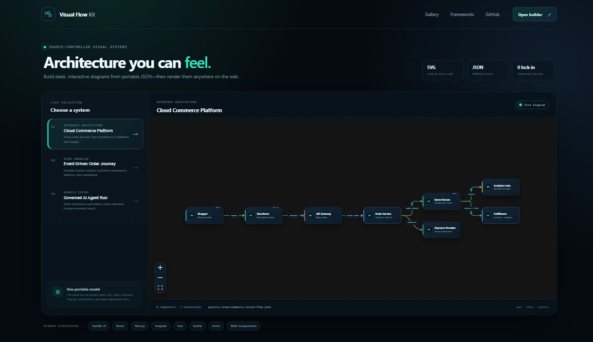
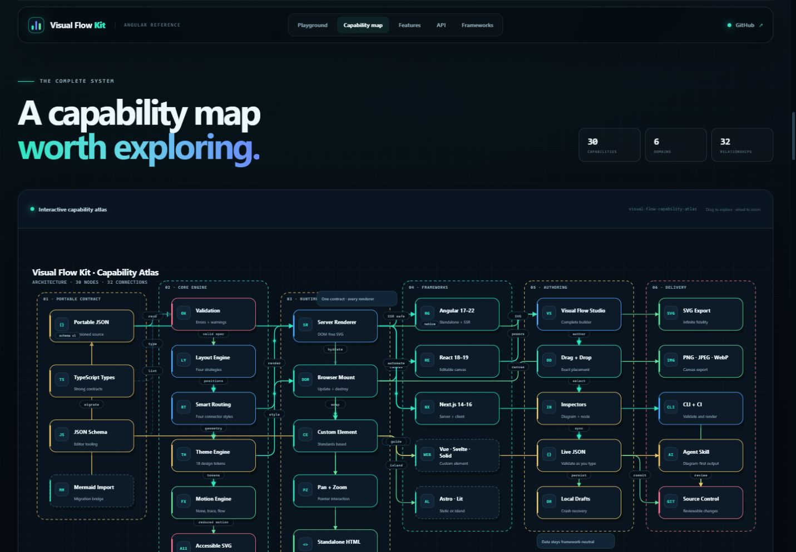

# Visual Flow Kit

Sleek architecture and flow diagrams with portable JSON source, deterministic layout, interactive web canvases, a drag-and-drop builder, framework adapters, exports, and an agent skill that can replace Mermaid in documentation workflows.






## What is included

| Package or app | Purpose |
| --- | --- |
| `@sentimental37/visual-flow` | Framework-neutral model, validation, Dagre/grid/lane/manual layouts, SVG/HTML/raster export, themes, motion, and a Web Component. |
| `@sentimental37/visual-flow-react` | React 18/19 interactive canvas, editing, selection, pan/zoom, controls, and minimap. |
| `@sentimental37/visual-flow-next` | Next.js server-rendered static diagrams and an explicit client canvas entry. |
| `@sentimental37/visual-flow-angular` | Angular 17–22 standalone component in Angular Package Format with SSR guards. |
| `@sentimental37/visual-flow-cli` | Validate, inspect, render, export, and migrate Mermaid into Visual Flow JSON. |
| Visual Flow Studio | Complete drag/drop builder with inspectors, themes, JSON editing, automatic layout, local recovery, and export. |
| Demo Gallery | Polished examples that exercise architecture, workflow, data-flow, dark/light themes, and motion. |
| Angular Demo | Full reference site with live theme-token customization, routing/direction/motion controls, six exports, feature galleries, a 30-node capability atlas, framework matrix, code recipes, and complete API/schema documentation. |
| Agent skill | Instructions, schema reference, starter source, and rendering helper for agents creating Visual Flow instead of Mermaid. |

Vue, Svelte, Solid, Lit, Astro, and plain JavaScript use the standards-based `<visual-flow>` custom element from the core package.

## Run locally

Requirements: Node.js 20.19 or newer and npm 10 or newer.

```powershell
npm install
npm run verify
npm run dev:gallery
```

Open `http://127.0.0.1:4327`. Start the builder separately with:

```powershell
npm run dev:studio
```

Open `http://127.0.0.1:4317`.

Start the Angular showcase with:

```powershell
npm run dev:angular
```

Open `http://127.0.0.1:4200`.

## Smallest useful example

```ts
import { renderVisualFlow } from "@sentimental37/visual-flow";

const { svg } = renderVisualFlow({
  schemaVersion: 1,
  id: "request-path",
  kind: "architecture",
  title: "Request path",
  layout: { mode: "dagre", direction: "LR" },
  theme: "midnight-current",
  motion: "flow",
  nodes: [
    { id: "web", label: "Web App", variant: "client" },
    { id: "api", label: "API", variant: "service" },
    { id: "data", label: "Database", variant: "data" }
  ],
  edges: [
    { from: "web", to: "api", variant: "accent", animated: true },
    { from: "api", to: "data", label: "query" }
  ]
});
```

See [framework integrations](docs/FRAMEWORKS.md), the [core package guide](packages/visual-flow/README.md), and the checked-in [examples](packages/visual-flow/examples).

## Use the agent skill

Copy `agent-skills/create-visual-flow-diagram` into the skills directory used by your agent, or let an agent read it directly from this repository. The skill tells agents to keep `*.visual-flow.json` as source, validate it, render SVG and standalone HTML, visually inspect the result, and use Mermaid only as a migration input.

Inside this repository, after `npm run build`:

```powershell
node agent-skills/create-visual-flow-diagram/scripts/render-visual-flow.mjs packages/visual-flow/examples/cloud-commerce.visual-flow.json artifacts/rendered
```

## Quality gates

```powershell
npm run verify
npm run pack
npm run verify:distribution
```

The repository uses the MIT License. Package publication is intentionally not automatic: publishing to npm or GitHub Packages still requires credentials and an explicit release decision.
