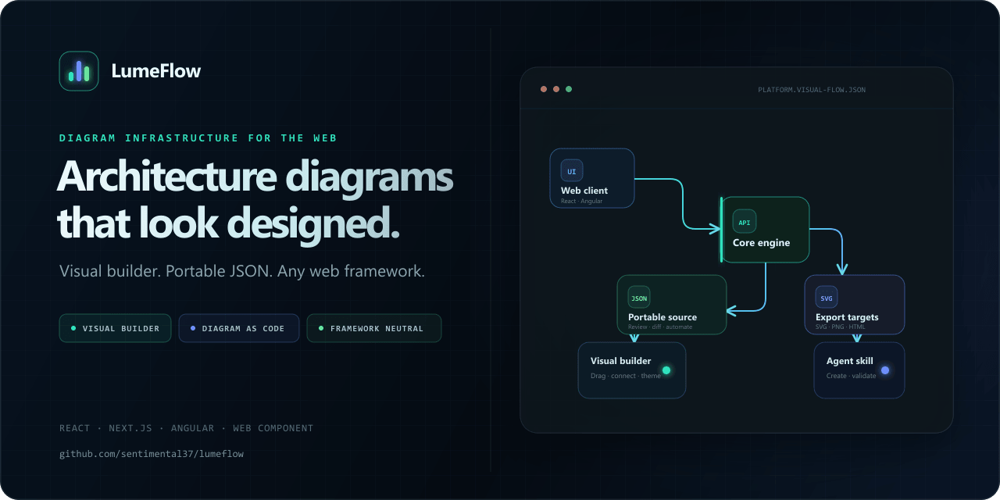
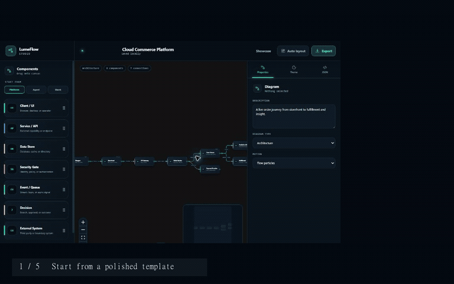
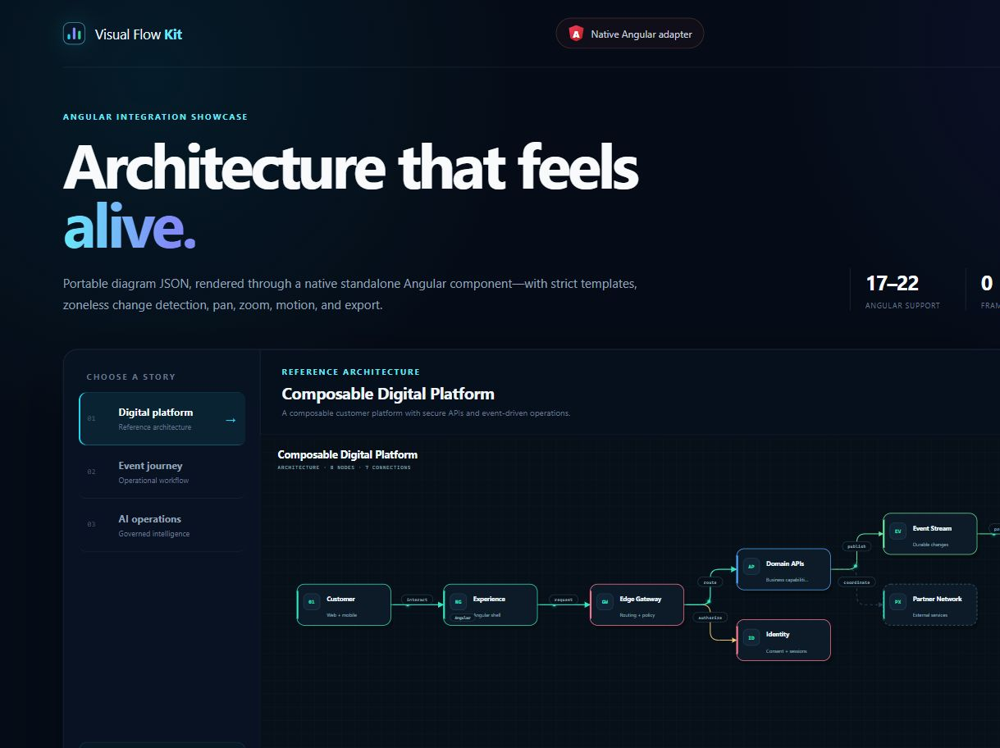
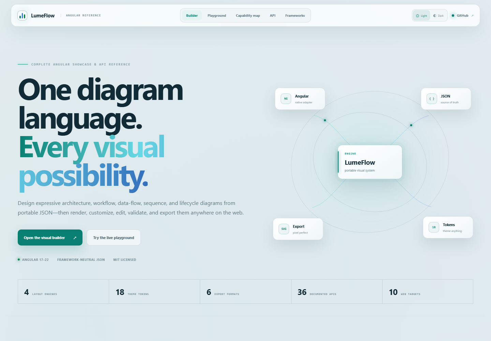
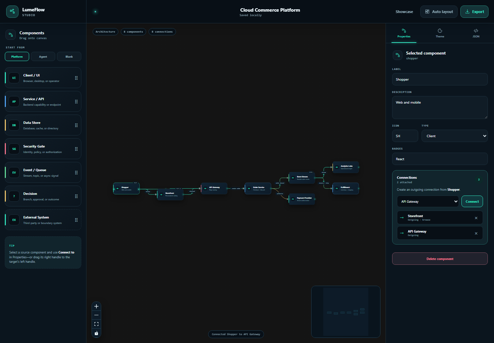
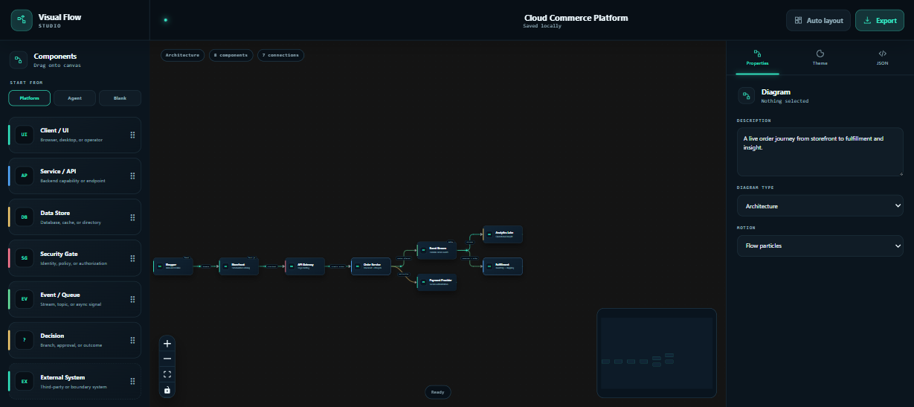

# LumeFlow

**Architecture diagrams that look designed—without giving up code, portability, or framework choice.**

[Live showcase](https://sentimental37.github.io/lumeflow-showcase/) · [Open the visual builder](https://sentimental37.github.io/lumeflow-showcase/builder/) · [Framework guide](docs/FRAMEWORKS.md) · [Roadmap](ROADMAP.md) · [MIT License](LICENSE)

[](https://github.com/sentimental37/lumeflow/actions/workflows/ci.yml)




LumeFlow is a complete diagram system for architecture, workflow, data-flow, sequence, and lifecycle visuals. A readable JSON document is the source of truth. The same source can be edited in the browser, rendered in Angular, React, Next.js, or a Web Component, validated in CI, exported for documents, and created by an agent instead of Mermaid.

> LumeFlow is currently a source release. The `@lumeflow/*` package names describe the intended public package surface; npm publication is a separate release step and has not been claimed in this README.

## Why LumeFlow

- **Sleek by default.** Curved and orthogonal routing, deliberate spacing, semantic node treatments, motion, and polished dark and light themes.
- **Visual and code-first.** Build with drag and drop, then keep the portable JSON in source control.
- **Framework-neutral.** One core model with native React, Next.js, and Angular adapters plus a standards-based custom element.
- **Deterministic.** The same source produces the same layout and SVG in browsers, servers, command-line jobs, and CI.
- **Exportable.** JSON, SVG, standalone HTML, PNG, JPEG, and WebP are generated from the same document.
- **Agent-ready.** A bundled skill teaches agents to create LumeFlow source, validate it, render it, and visually inspect the result.

## Product surfaces

| Surface | What it provides |
| --- | --- |
| [Showcase](https://sentimental37.github.io/lumeflow-showcase/) | Interactive themes, layouts, routing, motion, exports, complete API documentation, framework recipes, and the 30-node capability atlas. |
| [Studio](https://sentimental37.github.io/lumeflow-showcase/builder/) | Full-screen drag-and-drop builder with templates, connection editing, inspectors, theme workbench, JSON editing, validation, local recovery, and export. |
| `@lumeflow/core` | Portable model, validation, Dagre/grid/lane/manual layouts, SVG/HTML/raster export, themes, motion, DOM mounting, and a Web Component. |
| `@lumeflow/react` | React 18/19 editable canvas, selection, connection editing, pan/zoom, controls, and minimap. |
| `@lumeflow/next` | Next.js App Router and Pages Router static/server rendering plus an explicit client canvas entry. |
| `@lumeflow/angular` | Angular 17–22 standalone component in Angular Package Format with SSR guards. |
| `@lumeflow/cli` | Validate, inspect, render, export, emit the schema, and migrate Mermaid topology. |
| Agent skill | Instructions, schema reference, starter source, and a rendering helper for agent-authored diagrams. |

## See the builder in 22 seconds



[Open the interactive builder](https://sentimental37.github.io/lumeflow-showcase/builder/) · [Download the HD MP4](docs/brand/lumeflow-builder-demo.mp4)





## Run the complete site

Requirements: Node.js 20.19 or newer and npm 10 or newer.

```powershell
npm install
npm run verify
npm run build:site
npm run preview:site
```

Open `http://127.0.0.1:4200/`. The documentation and showcase are at `/`; the full builder is at `/builder/`.

For focused development:

```powershell
npm run dev:angular  # Angular showcase with HMR on port 4200
npm run dev:studio   # Studio with HMR on port 4317
npm run dev:gallery  # Standalone gallery on port 4327
```

## Smallest useful example

```ts
import { renderVisualFlow } from "@lumeflow/core";

const diagram = {
  schemaVersion: 1,
  id: "request-path",
  kind: "architecture",
  title: "Request path",
  layout: { mode: "dagre", direction: "LR" },
  theme: "midnight-current",
  motion: "flow",
  nodes: [
    { id: "web", label: "Web App", variant: "client" },
    { id: "api", label: "API", variant: "service" },
    { id: "data", label: "Database", variant: "data" }
  ],
  edges: [
    { from: "web", to: "api", variant: "accent", animated: true },
    { from: "api", to: "data", label: "query" }
  ]
} as const;

const { svg } = renderVisualFlow(diagram);
```

The source remains ordinary data:

```text
LumeFlow JSON → validate → deterministic layout → SVG/interactive canvas → export
```

## Framework recipes

### React

```tsx
import { VisualFlow } from "@lumeflow/react";
import "@lumeflow/react/styles.css";

export function Architecture({ spec }) {
  return <VisualFlow spec={spec} />;
}
```

Set `editable`, `onSpecChange`, `onSelectionChange`, and `onCanvasDrop` to turn the renderer into an editor.

### Next.js

```tsx
import { VisualFlowStatic } from "@lumeflow/next";

export default function Page() {
  return <VisualFlowStatic spec={diagram} />;
}
```

Use `@lumeflow/next/client` when the page needs editing, pan/zoom, selection, or client-side interaction.

### Angular

```ts
import { Component } from "@angular/core";
import { VisualFlowAngularComponent } from "@lumeflow/angular";

@Component({
  standalone: true,
  imports: [VisualFlowAngularComponent],
  template: `<visual-flow-diagram [spec]="diagram" />`,
})
export class ArchitectureComponent {
  diagram = diagram;
}
```

### Vue, Svelte, Solid, Lit, Astro, or plain JavaScript

```ts
import { defineVisualFlowElement } from "@lumeflow/core/element";

defineVisualFlowElement();
document.querySelector("visual-flow")!.spec = diagram;
```

```html
<visual-flow pan-zoom="true"></visual-flow>
```

See [docs/FRAMEWORKS.md](docs/FRAMEWORKS.md) for lifecycle, SSR, editing, and version guidance.

## Studio workflow

1. Open `/builder/` and choose an architecture, workflow, or lifecycle template.
2. Drag a component onto the canvas—or click a palette item to add it precisely.
3. Select a source component and choose a target in the **Connect to** control, or drag the source's glowing right handle to the target's left handle.
4. Select a node to edit its label, description, semantic type, icon, and badges.
5. Tune built-in themes or individual color and radius tokens.
6. Review or edit the underlying JSON, then validate and apply it.
7. Export JSON, SVG, HTML, PNG, or WebP.

The Properties inspector lists every incoming and outgoing connection for the selected component and lets you remove individual links without editing JSON.





Drafts are stored locally in the browser and restored automatically. The builder does not require an account or backend.

## CLI

After building the workspace, the CLI can be run from its package or a packed archive:

```powershell
npx lumeflow validate docs/architecture.visual-flow.json
npx lumeflow inspect docs/architecture.visual-flow.json
npx lumeflow render docs/architecture.visual-flow.json --format svg --output docs/architecture.svg
npx lumeflow schema --output visual-flow.schema.json
npx lumeflow migrate-mermaid old-flow.mmd --output migrated.visual-flow.json
```

Mermaid migration imports topology and labels; it does not claim style fidelity.

## Agent skill

The reusable skill lives at [`agent-skills/create-lumeflow-diagram`](agent-skills/create-lumeflow-diagram). It instructs an agent to treat `*.visual-flow.json` as the maintained source, validate before rendering, generate SVG and standalone HTML, inspect the result visually, and use Mermaid only as a migration input.

After `npm run build`:

```powershell
node agent-skills/create-lumeflow-diagram/scripts/render-lumeflow.mjs packages/visual-flow/examples/cloud-commerce.visual-flow.json artifacts/rendered
```

## Repository structure

```text
apps/angular-demo                     Full documentation and API showcase
apps/gallery                          Focused visual example gallery
packages/visual-flow                  Framework-neutral core
packages/visual-flow-react            React adapter and editor
packages/visual-flow-next             Next.js static and client adapters
packages/visual-flow-angular          Angular standalone adapter
packages/visual-flow-cli              CLI and Mermaid topology migration
packages/visual-flow-studio           Full-screen visual builder
agent-skills/create-lumeflow-diagram  Agent authoring skill
docs                                  Framework guide and screenshots
scripts                               Packaging and combined-site assembly
```

## Quality gates

```powershell
npm run verify
npm run build:site
npm run pack
npm run verify:distribution
```

`npm run verify` builds, typechecks, and tests every workspace. Distribution verification checks all five public package archives and their publication manifests.

## Deployment

`npm run build:site` assembles one portable static artifact in `site-dist`: the Angular showcase at `/` and LumeFlow Studio at `/builder/`. The public build is hosted from the dedicated [`lumeflow-showcase`](https://github.com/sentimental37/lumeflow-showcase) GitHub Pages repository, while this repository remains the public source of truth.

The root [`vercel.json`](vercel.json) describes the same artifact for teams that prefer Vercel. It can be deployed directly from this repository after connecting a Vercel account, or with `vercel --prod`.

## Security and data boundaries

- Diagram labels and metadata are treated as data and escaped before SVG output.
- The default renderer does not execute user-provided markup.
- Studio drafts stay in browser storage unless the user exports them.
- The Angular adapter guards browser-only work for server rendering.
- Rendering honors reduced-motion preferences and emits accessible SVG titles and descriptions.

## Status

LumeFlow is at `0.1.0` and under active development. Public npm publication, collaborative cloud storage, and real-time multi-user editing are not part of the current release.

See the [roadmap](ROADMAP.md), [changelog](CHANGELOG.md), [release process](docs/RELEASING.md), and [support guide](SUPPORT.md). Questions and design discussions belong in [GitHub Discussions](https://github.com/sentimental37/lumeflow/discussions); security reports follow the private process in [SECURITY.md](SECURITY.md).

## License

[MIT](LICENSE) © 2026 LumeFlow contributors.
